# 화면 갤러리 · 2026-09-09

CI에서 촬영한 React 화면의 대표 이미지 12장이다. 모든 PC·휴대폰·요청은
시험 데이터다. 휴대폰 크기의 Chromium 화면이며 실제 Android 캡처는 아니다.
실제 UAC 승인과 휴대폰 인증은 사용자가 나중에 직접 확인한다.

[촬영 실행](https://github.com/115dkk/Windows_UAC_Remote_Controller/actions/runs/34276434168)
에서 Windows·Linux 각 26개 시나리오가 통과했고 각 39장을 생성했다.
이 성공은 전체 프로그램 완성이나 전체 Rust 품질 검사 성공을 뜻하지 않는다.
촬영 소스는 `37890c71e0a1bf4bbd56ada456b4900c28d1fcb7`이다.
알림 설정 이동 화면 2장은 이후 소스 `449a9418af379d465cee23cbbd93cb68c12d43f0`의
[추가 촬영 실행](https://github.com/115dkk/Windows_UAC_Remote_Controller/actions/runs/34289874447)
에서 가져왔다. 이 실행은 Windows·Linux 각각 27개 시나리오와 42개 캡처가 통과했다.
기록 화면 2장은 소스 `dac04a99e0b60022068eb6b0f06336941a12a3ef`의
[기록 화면 촬영 실행](https://github.com/115dkk/Windows_UAC_Remote_Controller/actions/runs/34298827980)
에서 가져왔다. Windows·Linux 각각 29개 시나리오와 44개 캡처가 통과했다.

## PC 상태

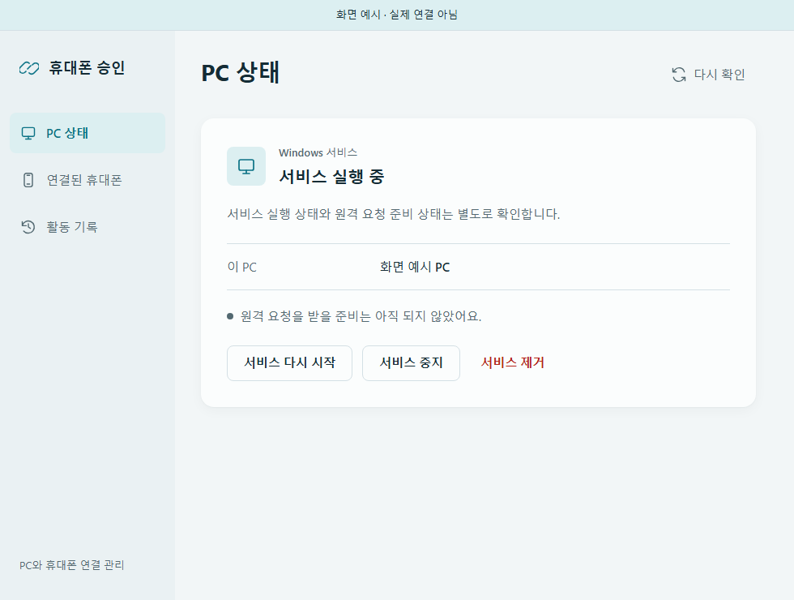

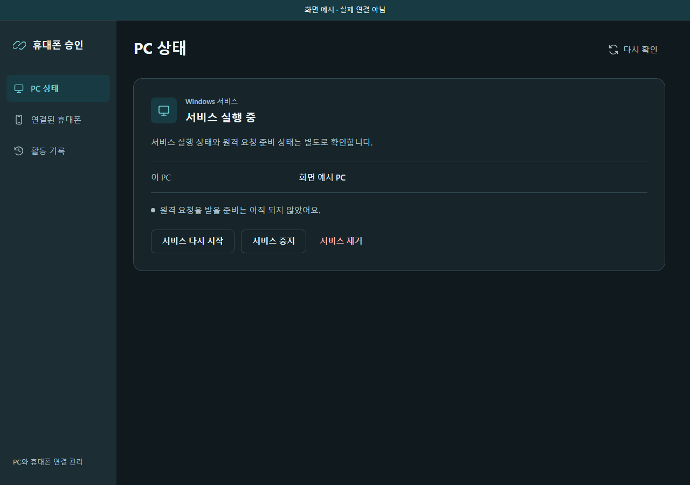

## 휴대폰 요청과 명령어

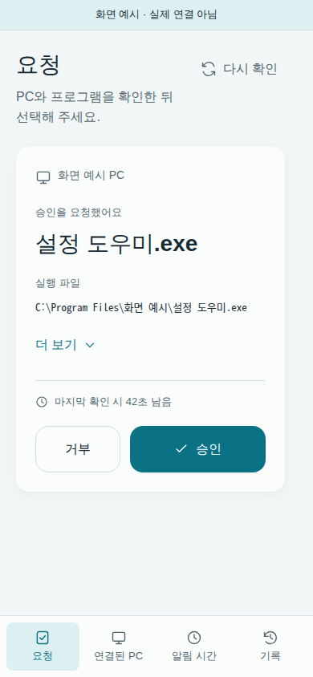

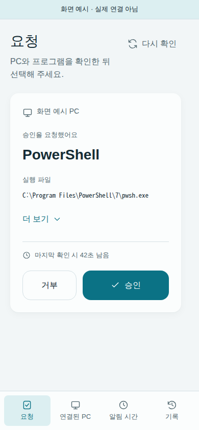

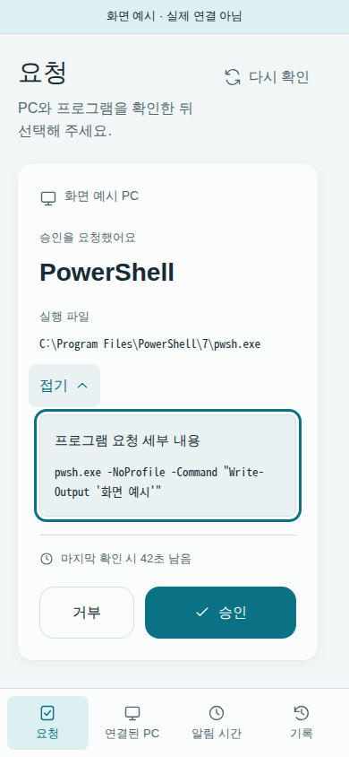

## 알림 시간과 방식

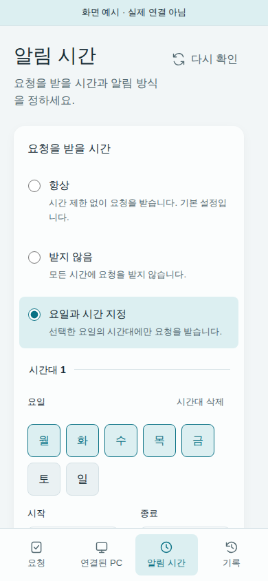

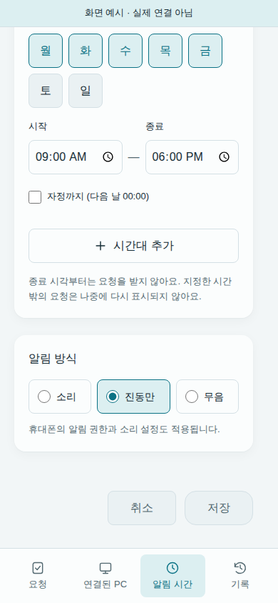

## 잠금 설정 안내

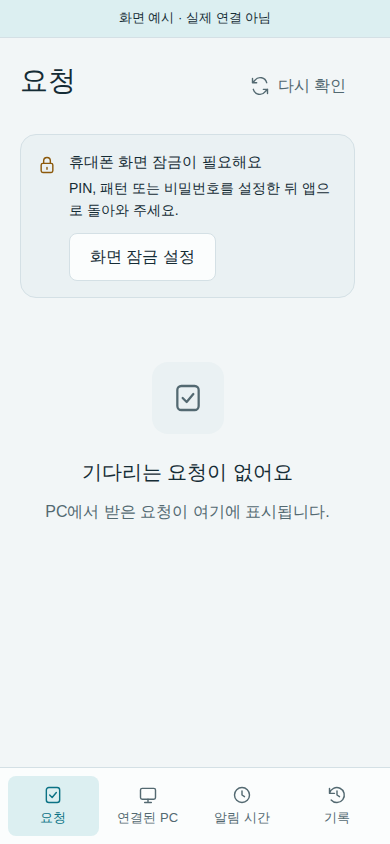

## 앱 알림 설정으로 이동

알림이 꺼져 있으면 이 앱의 Android 알림 설정으로 이동하는 버튼을 제공한다.
아래는 그 버튼과 이동 뒤 안내의 **클라이언트 예시**다. Android 설정 화면을
촬영한 것이 아니며, 화면 이동을 알림 허용 성공으로 표시하지 않는다.

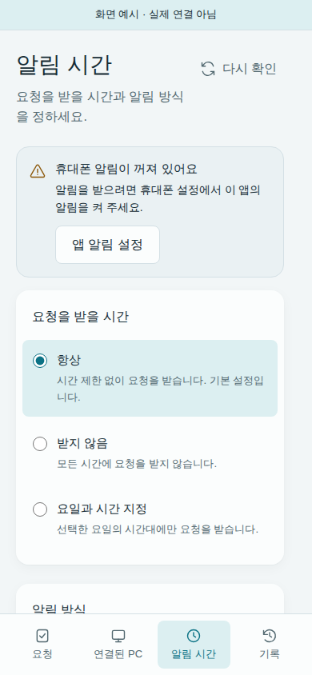

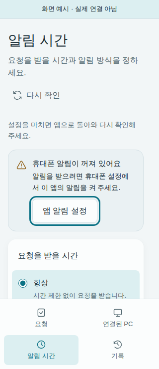

추가 두 이미지의 출처와 해시는 [추가 촬영 목록](notification-settings-manifest.json)에 있다.

## 휴대폰 기록

요청이 PC에서 끝났다는 기록을 승인 성공으로 바꾸어 표시하지 않는다.
아래는 종료·만료 기록과 기록이 없을 때의 클라이언트 예시다. 실제 휴대폰에서
요청을 받거나 승인한 기록은 아니다.

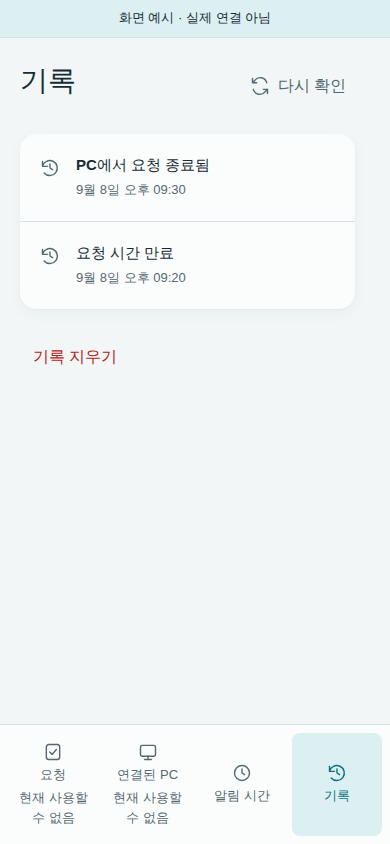

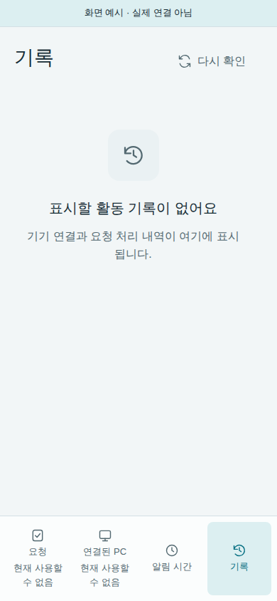

기록 화면의 출처와 해시는 [기록 촬영 목록](phone-history-manifest.json)에 있다.

기존 8개 이미지의 출처와 SHA-256은 [촬영 목록](capture-manifest.json)에 있다.
원본 PNG를 변경하지 않고 보관했으며 실제 키·QR 비밀·개인 요청은 포함하지 않는다.
