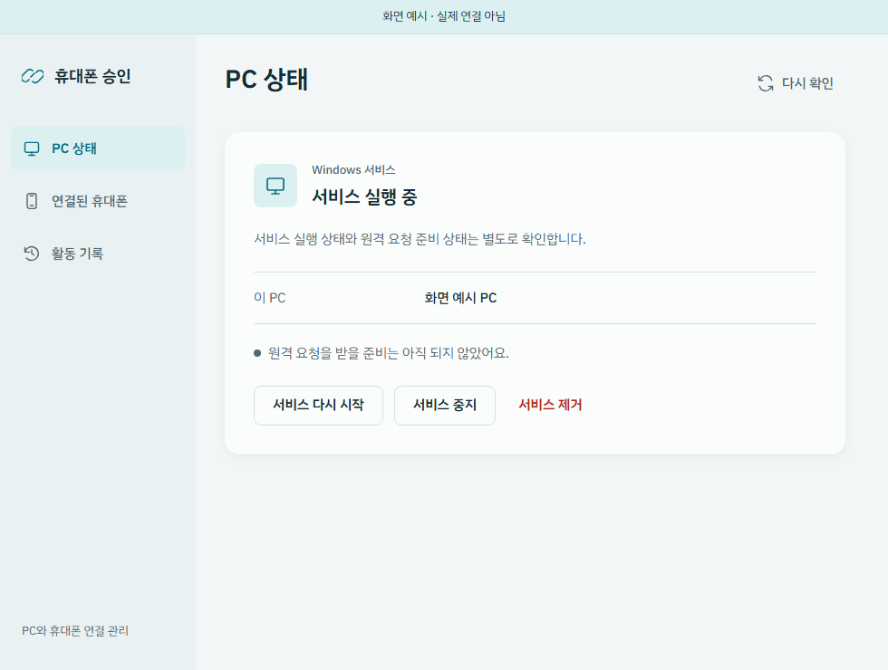
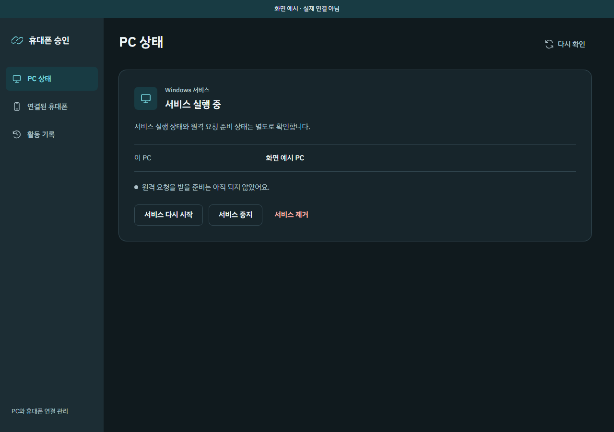
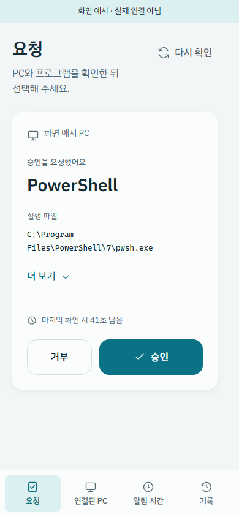
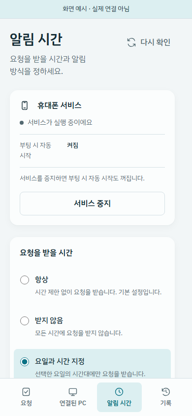

# IBM Plex Sans KR 적용 화면

PC와 휴대폰 화면에 IBM Plex Sans KR을 적용했습니다. 본문·제목·버튼을 같은
한글 서체로 맞추고, 설명과 설정 이름은 단어 단위로 줄바꿈합니다. 명령어와
실행 파일 경로의 고정폭 글꼴은 유지했습니다.

아래는 Windows CI의 Chromium에서 촬영한 **예시 화면**입니다. 실제 연결·UAC
승인·휴대폰 인증 결과가 아니며, 휴대폰 화면도 실제 Android 기기를 촬영한
것은 아닙니다. 원본 PNG를 수정하지 않았습니다.

## PC 관리

## 휴대폰

## 촬영 출처

- 앱 소스: `a40ee3b9db56e91a8ccb05599a446cdc5d5b8814`.
- [갤러리 CI](https://github.com/115dkk/Windows_UAC_Remote_Controller/actions/runs/34439778443): Windows·Linux 각각44개 시나리오 통과,65장 촬영.
- [Windows 전체 자료](https://github.com/115dkk/Windows_UAC_Remote_Controller/actions/runs/34439778443/artifacts/10137618642).
- [Linux 전체 자료](https://github.com/115dkk/Windows_UAC_Remote_Controller/actions/runs/34439778443/artifacts/10137523803).
- [파일별 원본 출처·해시](capture-manifest.json).
- [서체 원본](https://github.com/IBM/plex/tree/1da12f02587b630c07e92692d21492d722f53614/packages/plex-sans-kr): OFL1.1, 앱에 라이선스와 함께 포함.

최상위 에이전트가 대표 이미지를 직접 검토했습니다. CI는 각 운영체제의
기존 화면 요소6곳에서 실제 IBM 서체 렌더링도 확인했습니다. 이 검사는
설치된 Tauri 창·실제 휴대폰의 글꼴 표시나 전체 원격 승인 기능의 완료를
뜻하지 않습니다. Android 시스템 알림과 인증 창은 시스템 글꼴을 유지합니다.

CI 전체 자료는14일 보관 설정입니다. 위 원본4장은 이 저장소에 별도 보관합니다.
