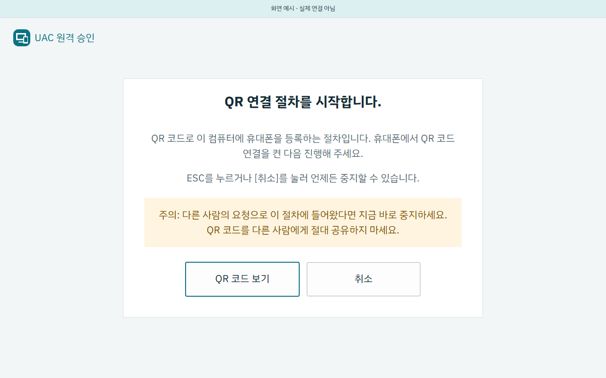
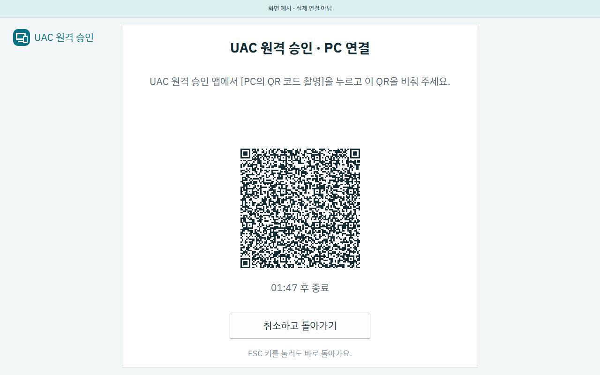
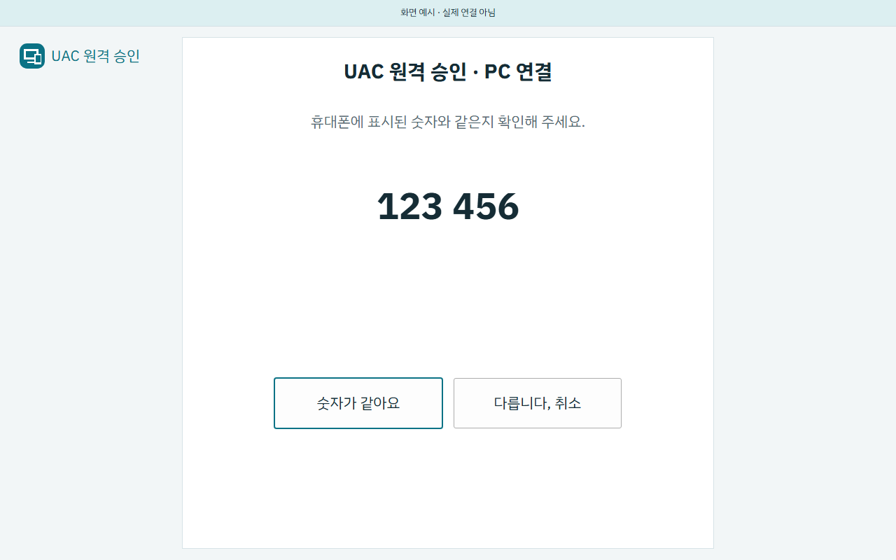
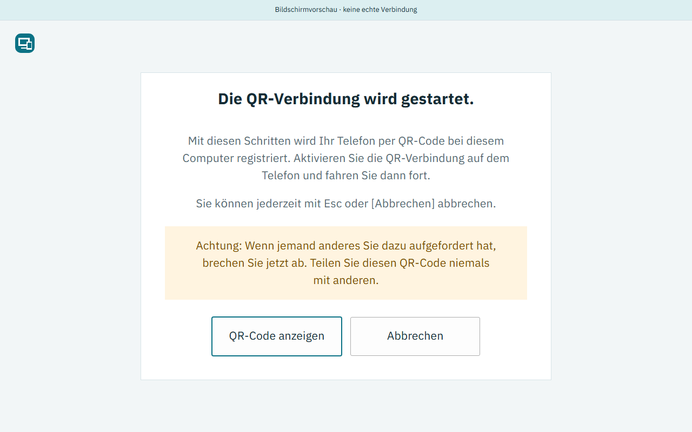
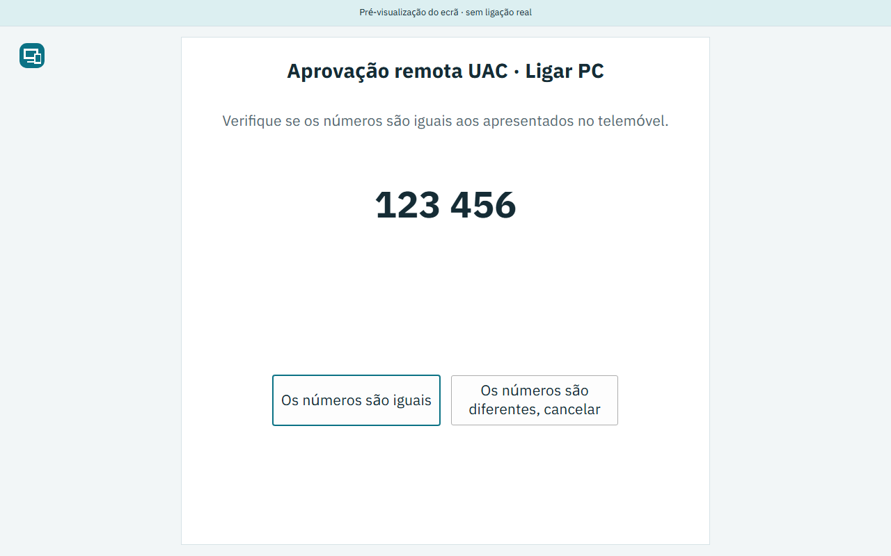
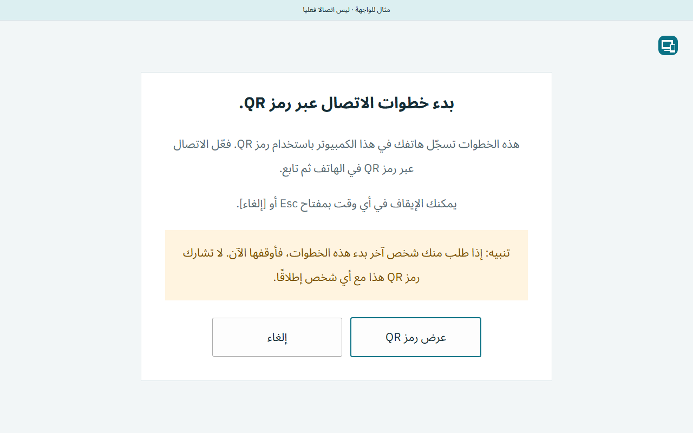

# 화면 갤러리 · PC 연결 세레모니 · 2026-09-16

PC에서 휴대폰을 연결할 때 화면 전체를 덮는 세 화면의 대표 이미지 6장이다.

**이 화면들은 실제로는 GDI가 보호된 데스크톱에 그린다.** 여기 있는 것은
같은 배치와 같은 문구를 클라이언트에서 다시 그린 것이며, 네이티브가 그렸다는
증거가 아니고 데스크톱 전환을 보여 주지도 않는다. QR에는 초대장이 들어 있지
않다. 아무 의미 없는 문장을 부호화한 표본이며, 그 문장 자체가 표본이라고
말한다. 비교 숫자 `123 456`도 고정된 예시다. 실제 연결 숫자는 시도마다 새로
만들어지고 보호된 데스크톱을 떠나지 않는다.

실제 UAC 승인과 휴대폰 인증은 사용자가 직접 확인할 항목으로 남아 있다.

[촬영 실행](https://github.com/115dkk/Windows_UAC_Remote_Controller/actions/runs/35042956322)
에서 141개 시나리오가 모두 통과했다. 촬영 소스는
`256a1aea61bc5fd8a70b1a73863f726c098b08f0`이고 Windows 러너의 원본을 그대로
올렸다. 이 통과는 전체 프로그램의 완성이나 실기 확인을 뜻하지 않는다.

## 안내 화면

무엇을 하는 절차인지, 휴대폰에서 무엇을 먼저 켜야 하는지, 어떻게 중지하는지를
먼저 알린다. [QR 코드 보기]를 눌러야 다음 화면으로 넘어간다. 주황색 칸은 다른
사람의 요청으로 들어왔다면 지금 중지하라는 경고다.

## QR 화면

[취소하고 돌아가기]가 항상 보이고 ESC도 받는다. 시간 표시는 남은 시간을 세지
않고 언제 끝나는지만 알린다.

## 비교 숫자 화면

## 번역이 긴 언어

한국어는 이 목록에서 가장 짧다. 상자를 한국어로 맞추면 다른 언어에서 글자가
잘리므로, 가장 긴 번역으로 재서 맞췄다. 아래 두 장이 그 증거다.

독일어는 문장이 세 줄로 늘어나고 카드가 따라서 커진다.

포르투갈어(포르투갈)는 단추 글자가 가장 길다. 240×72로 넓히기 전에는 세 줄이
필요한데 두 줄 자리밖에 없어 잘렸다.

## 오른쪽에서 왼쪽으로 쓰는 언어

아랍어는 글자와 배치가 모두 오른쪽에서 시작한다. QR 자체는 뒤집지 않는다.

